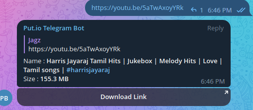
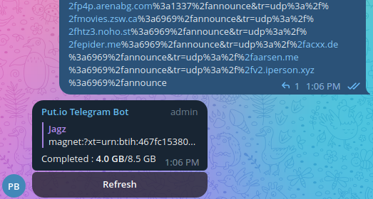

# Put.io Telegram Bot

This Telegram bot enables seamless torrent downloads and other youtubeDL supported sites by integrating with the put.io website service. With this bot, you can easily start downloading files/torrents and get their download links after completed downloading within the Telegram messaging platform.

## Features

-   **Transfer Management:** Add torrents/files to your put.io account and monitor the progress of your download transfers.
-   **Direct Download Links:** Seamlessly download completed torrents/files with generation of direct download links

-   **Access to anyone:** The generated download links can be shared to anyone and they can access them with high speed

## Requirements

To use this bot, you need the following:

-   A Telegram account
-   A put.io account

## Getting Started

To get started with the Telegram bot for downloads and put.io integration, follow these steps:

1. **Create a Telegram Bot:**

    - Visit the [BotFather](https://core.telegram.org/bots#botfather) on Telegram and create a new bot.
    - Obtain the bot token provided by the BotFather.

2. **Set Up the Bot:**

    - Clone this repository to your local machine.
    - Create a virtual environment 'env' using the command `python3 -m venv env`
    - Active the environment by `source env/bin/activate`
    - Install the necessary dependencies by running `pip install -r requirements`
    - Create `.env` file and set the following variables:

        - `BOT_TOKEN`: Bot token obtained from the BotFather.
        - `USER_TOKEN`: Put.io API token. You can obtain it from the [put.io website](https://app.put.io/settings/account).

    - Save the `.env` file.

3. **Deploy the Bot:**

    - Choose a hosting platform or server to deploy the bot (e.g., Heroku, AWS, DigitalOcean).
    - Configure the deployment environment according to the requirements of your chosen platform.
    - Deploy the bot code to the server.

4. **Start the Bot:**

    - Run the bot application on your deployed server.
    - The bot should now be online and ready to process commands.

5. **Interact with the Bot:**

    - Open the Telegram app and search for the bot using its username.
    - Start a chat with the bot and begin sending commands to add the torrents/downloads and get their direct download links

## Usage

-   Start the bot
-   Send any magnet link of torrents or any other youtubedl supported sites like youtube, twitter, etc..
-   The bot replies with status of downloading with a refresh button
-   Whenever refresh button is clicked, the downloading progress is shown
-   When the download is complete and when you refresh button, it replies with **direct download link**
-   Now, anyone can access the file with that link and shared to anyone !

## Screenshots

## Contributing

Contributions to this project are welcome! If you encounter any issues or have ideas for improvements, feel free to open an issue or submit a pull request. Make sure to adhere to the project's code style and guidelines.

## License

This project is licensed under the [MIT License](LICENSE).

## Acknowledgements

This Telegram bot for torrent/file downloads is built on the put.io API, and it wouldn't have been possible without the following contributions:

-   The put.io team for providing the API and services.
-   The Telegram team for their messaging platform and bot framework.
-   The open-source community for the various libraries and dependencies used in this project.
